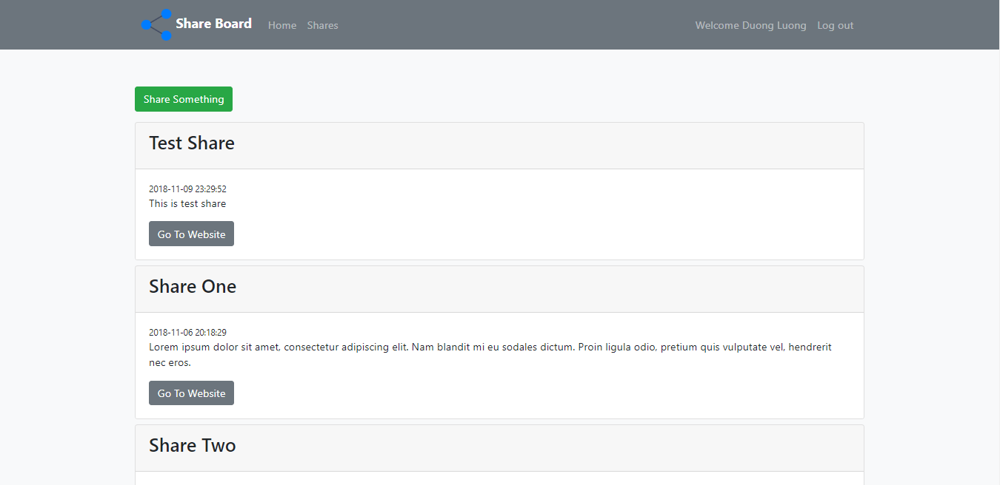

# shareboard-mvc-php
Part 1 of the project including Bootstrap Class, Controllers, Models and Views have completed.

Part 2 of the project including Adding Shares, User Authentication, Message function are still building.
## Table of Contents

* [Description](#Description)
* [Dependencies](#dependencies)

## Description

This project is Share Board which is applied MVC architecture. The project is created by PHP and MySQL.

The following photo is the Shares page:

## Dependencies

The project is cooperated with a JavaScript framework is Bootstrap.
